# GaaS Framework Visual Diagram Audit Report

**Date:** November 14, 2025
**Purpose:** Comprehensive audit of diagram opportunities across the GaaS framework
**Scope:** All Layer 0-4 documentation
**Tools Recommended:** Mermaid.js (embedded) + HTML infographics (standalone)

---

## Executive Summary

**Found:** 78 files with table/diagram content, 16 high-priority diagram opportunities
**Current State:** Section 11.1.3 and other technical sections contain ASCII art that could be enhanced
**Existing Assets:** 9 HTML infographics already created
**VitePress Support:** Mermaid.js supported by default (v1.6.4)

**Quick Wins:** 6 diagrams can be added immediately using Mermaid.js
**Medium-term:** 10 process/architecture diagrams requiring detailed design
**Long-term:** HTML infographic suite expansion for marketing/executive use

---

## Part 1: VitePress + Mermaid.js Setup

### ✅ Good News: Mermaid Already Supported

VitePress 1.6.4 includes **built-in Mermaid.js support** via the `markdown-it-mermaid` plugin. No configuration needed!

### How to Use Mermaid in Markdown

```markdown
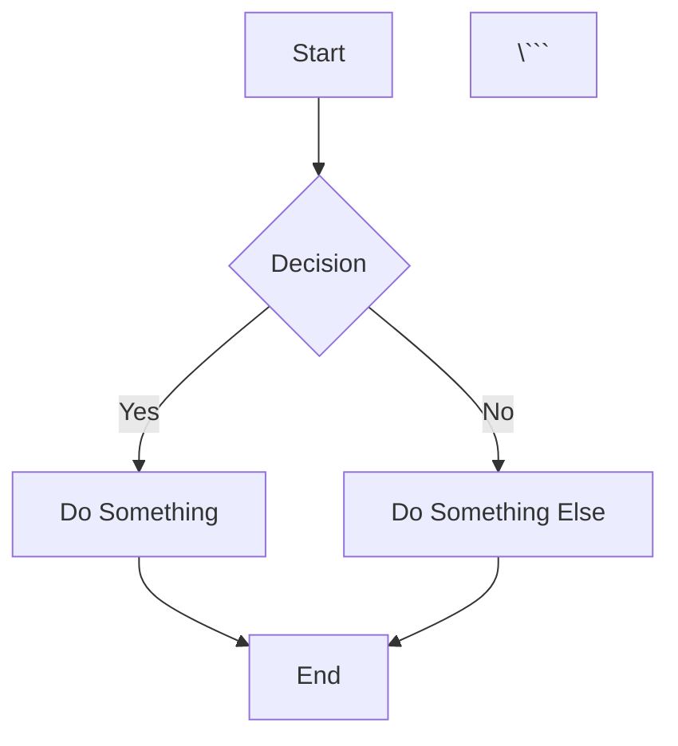

### Mermaid Diagram Types Available

1. **Flowchart** - Process flows, decision trees
2. **Sequence Diagram** - Actor interactions, API calls
3. **Class Diagram** - Data models, UML
4. **State Diagram** - Lifecycle, state machines
5. **Entity Relationship** - Database schemas
6. **Gantt Chart** - Timelines, roadmaps
7. **Pie Chart** - Proportions, budget allocation
8. **Git Graph** - Version control flows
9. **C4 Diagram** - Architecture (Context, Container, Component)

### Recommended Mermaid Theme

Add to `.vitepress/config.mts`:

```typescript
markdown: {
  config: (md) => {
    md.set({ breaks: true })
  }
},
themeConfig: {
  // ... existing config
},
mermaid: {
  theme: 'default',
  themeVariables: {
    primaryColor: '#334155',      // Slate 700 (brand primary)
    primaryTextColor: '#1e293b',  // Slate 800
    primaryBorderColor: '#475569', // Slate 600
    lineColor: '#0ea5e9',         // Sky Blue 500
    secondaryColor: '#14b8a6',    // Teal 500
    tertiaryColor: '#facc15'      // Amber 400
  }
}
```

---

## Part 2: Priority Diagram Opportunities

### 🔴 CRITICAL PRIORITY (Add Immediately)

These diagrams will have the highest impact on comprehension and are referenced most frequently.

#### 1. **Section 11.1.3: Digital Identity Platform Architecture**

**File:** `layer1-shared-technology-core/volume-3-technology-platform-architecture.md`
**Lines:** 168-221
**Current State:** ASCII box diagram (good, but can be enhanced)
**Recommended Enhancement:** Add Mermaid C4 Container diagram

**Why Critical:**
- Most referenced architecture in the framework
- Foundational to understanding digital government
- Currently has ASCII that could be professional

**Mermaid Replacement Example:**

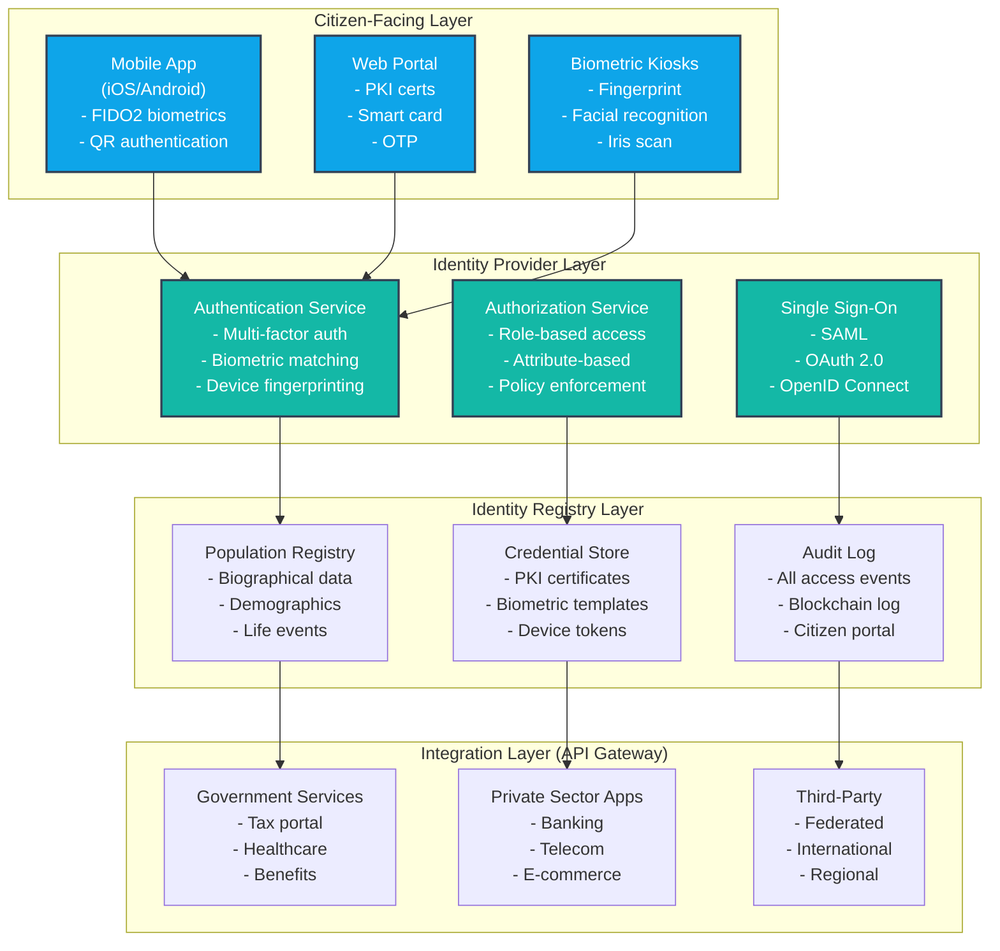

**Additional Diagram Needed:** User enrollment sequence diagram showing citizen journey

---

#### 2. **40-40-20 PPT Balance Visualization**

**File:** `layer2-people-process-engine/layer2-overview.md`
**Lines:** 11-28
**Current State:** Text description only
**Impact:** Core principle of entire Layer 2

**Mermaid Pie Chart:**

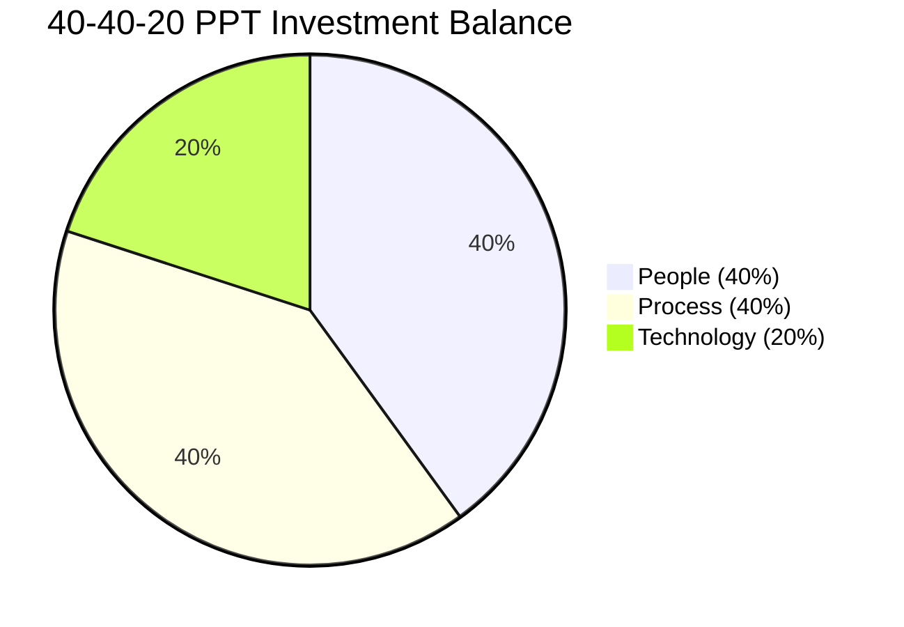

**Enhanced Version with Details:**

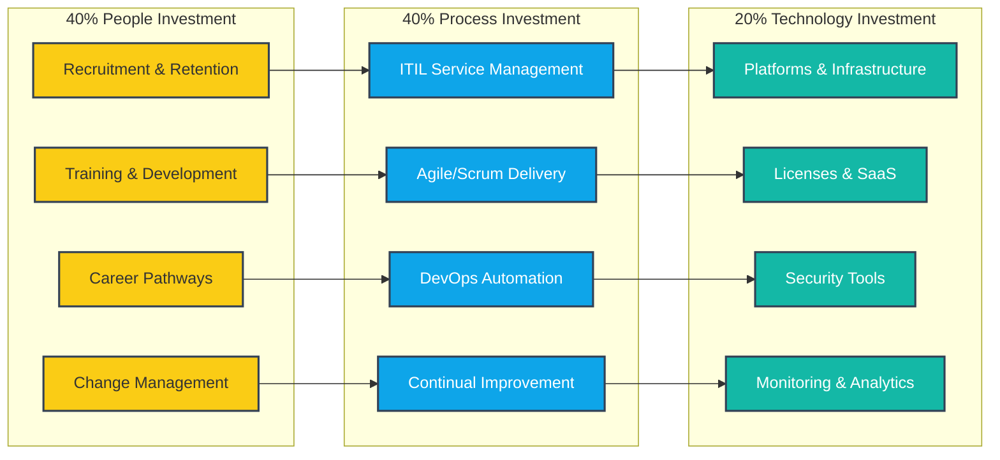

---

#### 3. **GaaS Service Value System (GSVS) Flow**

**File:** `gaas-service-value-system.md`
**Lines:** 1-100+
**Current State:** Text description of 5 components
**Impact:** Central to understanding how layers integrate

**Mermaid Flowchart:**

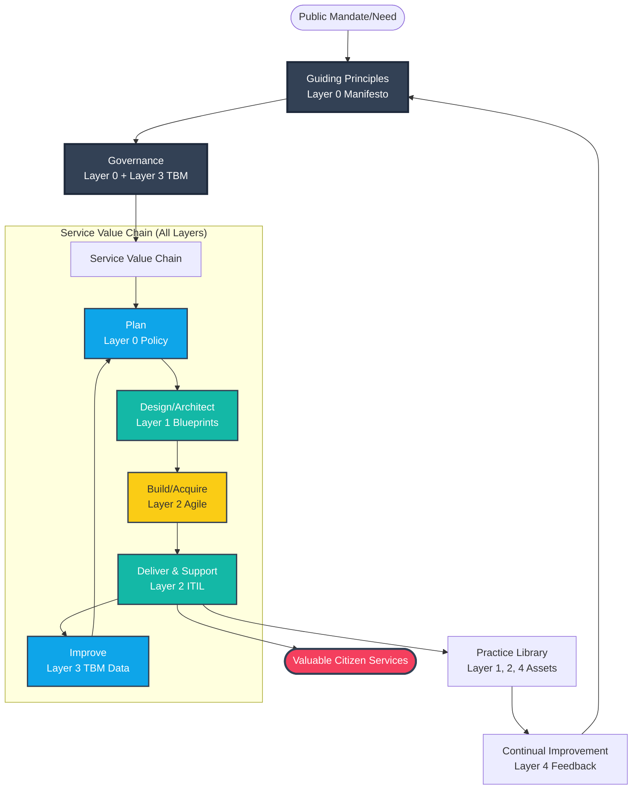

---

#### 4. **Section 12.1.2: API Gateway Architecture**

**File:** `layer1-shared-technology-core/volume-3-technology-platform-architecture.md`
**Lines:** 333-381
**Current State:** ASCII box diagram
**Enhancement:** Mermaid architecture + sequence diagram

**Architecture Diagram:**

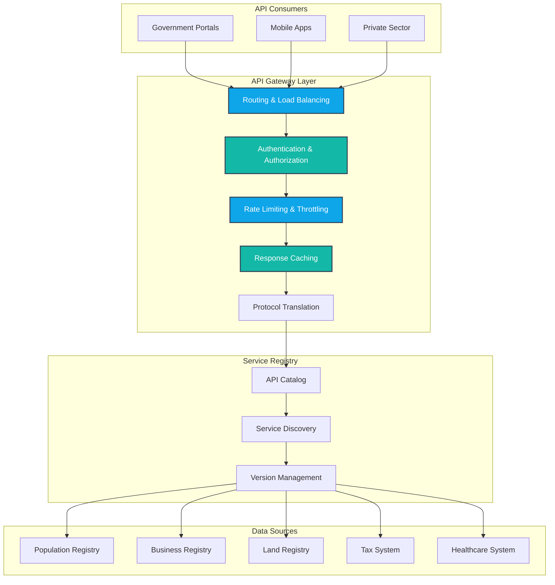

---

#### 5. **Section 14.1.2: Defense-in-Depth Security Layers**

**File:** `layer1-shared-technology-core/volume-3-technology-platform-architecture.md`
**Lines:** 854-894
**Current State:** ASCII tree outline
**Enhancement:** Concentric circle defense diagram

**Mermaid Layered Diagram:**

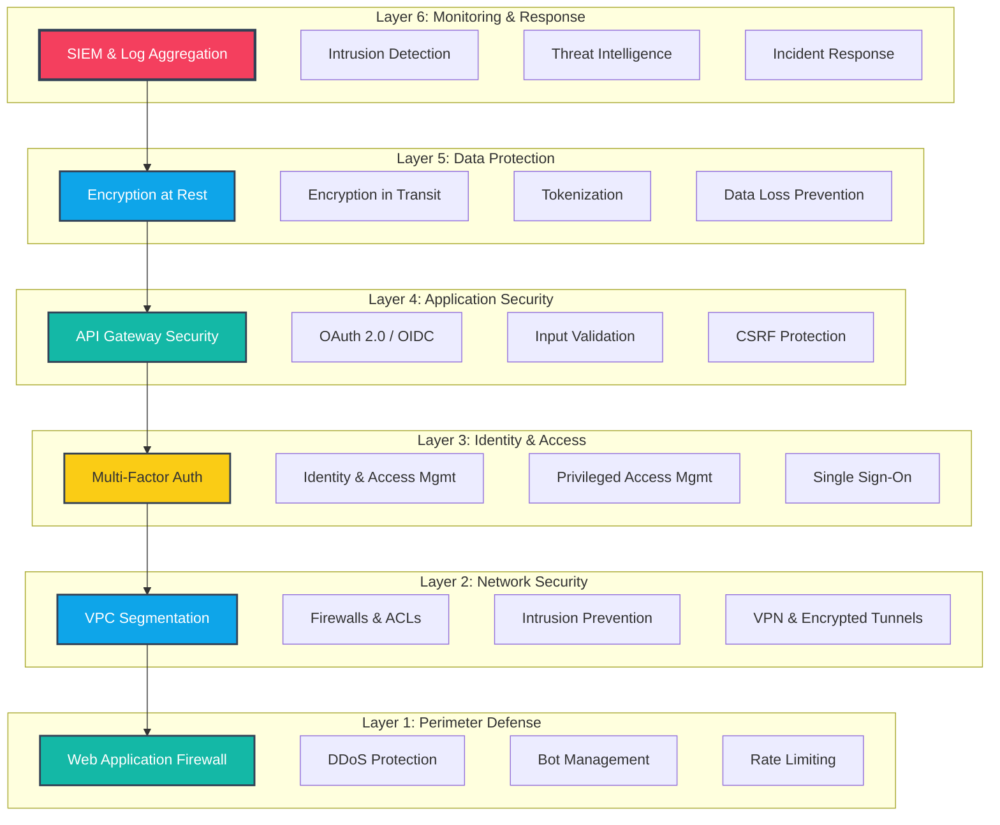

---

#### 6. **Fiscal Architecture: Budget Allocation Pie Chart**

**File:** `layer3-transparent-service-portfolio/fiscal-architecture.md`
**Lines:** 22-265
**Current State:** Tables with percentages
**Enhancement:** Pie chart + stacked bar comparison

**Budget Allocation by Layer:**

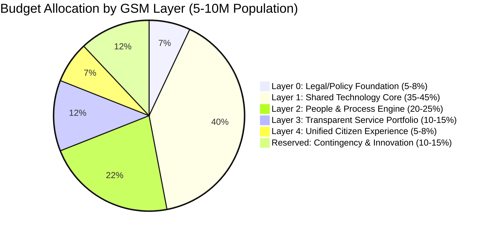

**ROI Comparison:**

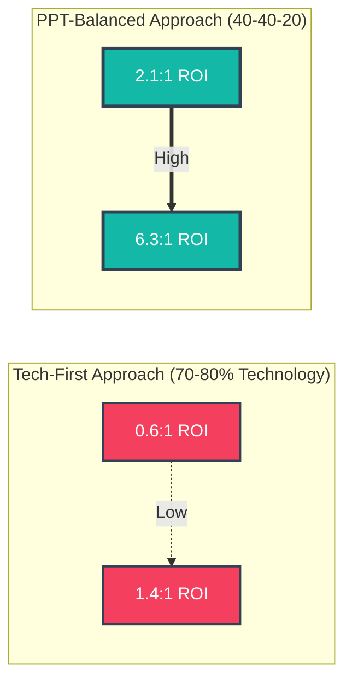

---

### 🟡 HIGH PRIORITY (Add This Month)

#### 7. **Build vs. Buy Decision Tree**

**File:** `layer3-transparent-service-portfolio/fiscal-architecture.md`
**Type:** Mermaid Flowchart
**Complexity:** Medium

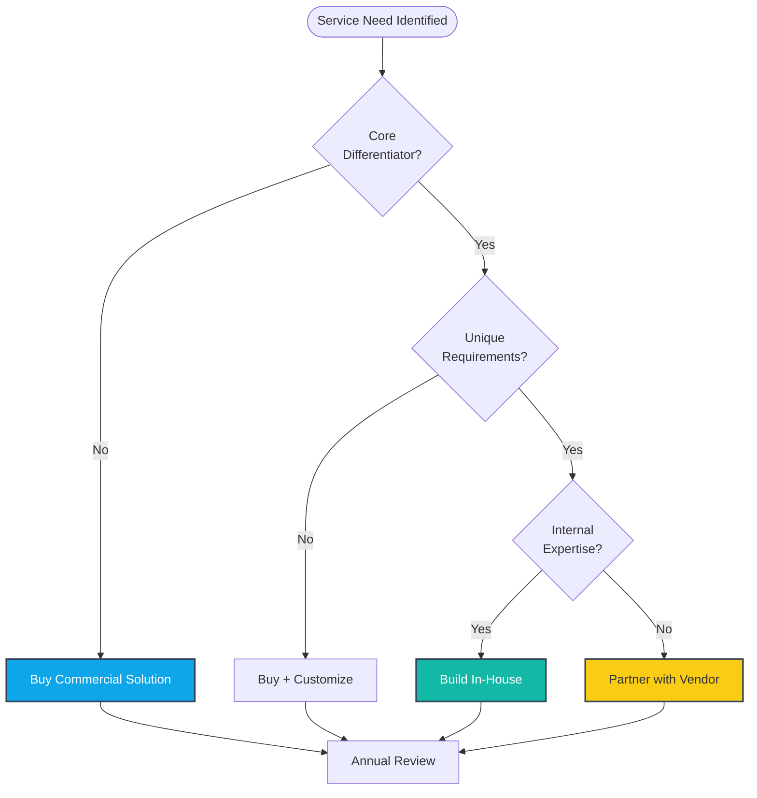

---

#### 8. **Service Portfolio Hierarchy (5-Level Decomposition)**

**File:** `layer2-people-process-engine/processes/process-service-portfolio-cost.md`
**Type:** Mermaid Tree Diagram
**Complexity:** Medium

```mermaid
graph TB
    L1[Level 1: Business Services<br/>Healthcare Insurance Service<br/>$45M/year]

    L1 --> L2A[Level 2: Technical Service<br/>Patient Registration<br/>$15M/year]
    L1 --> L2B[Level 2: Technical Service<br/>Claims Processing<br/>$20M/year]
    L1 --> L2C[Level 2: Technical Service<br/>Provider Network Mgmt<br/>$10M/year]

    L2A --> L3A[Level 3: Application<br/>Registration Portal<br/>$5M/year]
    L2A --> L3B[Level 3: Application<br/>Data Validation Engine<br/>$10M/year]

    L3A --> L4A[Level 4: Infrastructure<br/>Cloud Hosting: $1M<br/>Identity Platform: $2M<br/>API Gateway: $1M]

    L4A --> L5A[Level 5: Cost Allocation<br/>People: $2M (40%)<br/>Process: $2M (40%)<br/>Technology: $1M (20%)]

    style L1 fill:#334155,stroke:#1e293b,stroke-width:3px,color:#fff
    style L2A fill:#0ea5e9,stroke:#334155,stroke-width:2px,color:#fff
    style L2B fill:#0ea5e9,stroke:#334155,stroke-width:2px,color:#fff
    style L2C fill:#0ea5e9,stroke:#334155,stroke-width:2px,color:#fff
    style L3A fill:#14b8a6,stroke:#334155,stroke-width:2px,color:#fff
    style L3B fill:#14b8a6,stroke:#334155,stroke-width:2px,color:#fff
    style L4A fill:#facc15,stroke:#334155,stroke-width:2px
    style L5A fill:#f43f5e,stroke:#334155,stroke-width:2px,color:#fff
```

---

#### 9. **Digital Identity Implementation Timeline (Gantt Chart)**

**File:** `layer2-people-process-engine/processes/process-digital-identity.md`
**Type:** Mermaid Gantt
**Complexity:** Medium

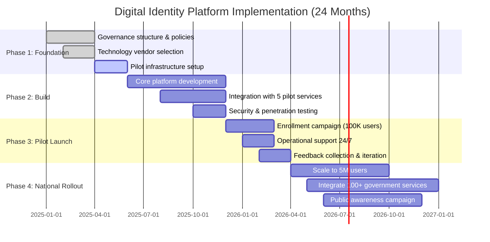

---

#### 10. **Co-Design Process Flow (5 Stages)**

**File:** `layer2-people-process-engine/processes/process-codesign-engagement.md`
**Type:** Mermaid Flowchart with Feedback Loops
**Complexity:** Medium

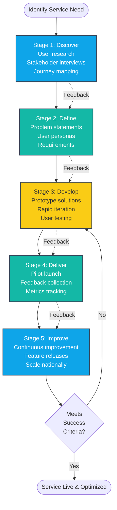

---

### 🟢 MEDIUM PRIORITY (Add Next Quarter)

#### 11-16. Additional Process & Technical Diagrams

| # | File | Diagram Type | Complexity |
|---|------|--------------|------------|
| 11 | `process-zero-trust.md` | Zero-Trust Architecture | High |
| 12 | `process-api-gateway.md` | API Lifecycle Management | Medium |
| 13 | `process-cybersecurity-operations.md` | SOC Workflow & Incident Response | High |
| 14 | `process-data-governance.md` | Data Lifecycle & Privacy Assessment | Medium |
| 15 | `volume-3-technology-platform-architecture.md` (Cloud) | Cloud Deployment Model Comparison | Medium |
| 16 | `layer0-overview.md` | Policy Interaction & Dependencies | Low |

---

## Part 3: HTML Infographic Opportunities

### Current Assets
**9 HTML infographics exist** in `docs/public/images/infographics/`

### Brand Guidelines for New Infographics

**Color Palette (from `press-kit/brand-guidelines.md`):**
- Primary: Slate 700 `#334155`
- Accent A (Process): Sky Blue 500 `#0ea5e9`
- Accent B (Digital): Teal 500 `#14b8a6`
- Accent C (People): Amber 400 `#facc15`
- Accent D (Contrast): Rose 500 `#f43f5e`

**Typography:**
- Font Family: Inter (clean, modern sans-serif)
- Headings: Bold, Slate 800 `#1e293b`
- Body: Normal, Slate 600 `#475569`

**Icons:**
- Recommended: Lucide Icons (https://lucide.dev/)
- Style: Line-art, consistent stroke width
- Color: Match accent colors

### Recommended New HTML Infographics

#### Infographic #10: Layer-Based Architecture (5 Layers + GSVS)
**Purpose:** Executive one-page overview
**Format:** Vertical stack showing all 5 layers with GSVS process overlaid
**Size:** 1200x2400px
**Complexity:** High

**Content:**
- Layer 0-4 as horizontal bands (color-coded by accent colors)
- GSVS process arrows showing flow across layers
- Key metrics per layer
- Evidence from real countries (Estonia, Singapore, UAE, Denmark)

---

#### Infographic #11: 40-40-20 PPT Investment Framework
**Purpose:** Visualize balanced investment approach vs. tech-first
**Format:** Side-by-side comparison
**Size:** 1600x1200px
**Complexity:** Medium

**Content:**
- Left: Tech-First (70-80% Technology) showing failure modes
- Right: PPT-Balanced (40-40-20) showing success metrics
- ROI comparison: 0.6:1-1.4:1 vs. 2.1:1-6.3:1
- Real-world examples (World Bank, Gartner data)

---

#### Infographic #12: Digital Identity Citizen Journey
**Purpose:** Show enrollment to daily use flow
**Format:** Horizontal timeline with user touchpoints
**Size:** 2400x1200px
**Complexity:** Medium

**Content:**
- 5 stages: Enrollment → Activation → First Use → Daily Use → Renewal
- User touchpoints at each stage (mobile, web, kiosk)
- Authentication methods
- Security checkpoints
- Time to complete each stage

---

#### Infographic #13: Service Portfolio Hierarchy (5-Level Decomposition)
**Purpose:** Visualize TBM cost allocation
**Format:** Pyramid or tree diagram
**Size:** 1600x1400px
**Complexity:** High

**Content:**
- Level 1: Business Services (Healthcare Insurance: $45M/year example)
- Level 2: Technical Services (3 decomposed services)
- Level 3: Applications (2-3 supporting apps)
- Level 4: Infrastructure (Cloud, Identity, API Gateway costs)
- Level 5: Cost Allocation (40-40-20 breakdown)

---

#### Infographic #14: API Gateway Architecture & Flow
**Purpose:** Technical reference diagram for architects
**Format:** Layered architecture with data flow
**Size:** 1800x1400px
**Complexity:** High

**Content:**
- 4 layers: Consumers → Gateway → Registry → Data Sources
- Request/response flow with sequence numbers
- Security controls at each layer
- Technology stack labels (Kong, Apigee, AWS API Gateway)

---

#### Infographic #15: Defense-in-Depth Security Model
**Purpose:** Visualize 6-layer security defense
**Format:** Concentric circles (castle defense metaphor)
**Size:** 1600x1600px
**Complexity:** Medium

**Content:**
- 6 concentric circles representing defense layers
- Attack vectors shown as arrows breaking through layers
- Security controls at each layer
- Real-world breach examples showing where layers stopped attacks

---

#### Infographic #16: GaaS Implementation Roadmap (24-36 Months)
**Purpose:** Executive timeline showing phased rollout
**Format:** Horizontal Gantt-style timeline
**Size:** 2400x1000px
**Complexity:** Medium

**Content:**
- Phase 1 (Months 0-12): Foundation (Layer 0 + Layer 1)
- Phase 2 (Months 12-24): Operational (Layer 2 + Layer 3)
- Phase 3 (Months 24-36): Citizen-Centric (Layer 4)
- Key milestones, deliverables, and decision gates
- Resource requirements by phase

---

## Part 4: Implementation Recommendations

### Quick Wins (Week 1)
1. Enable Mermaid theme in VitePress config
2. Add Diagram #2 (40-40-20 PPT Pie Chart) to `layer2-overview.md`
3. Add Diagram #3 (GSVS Flow) to `gaas-service-value-system.md`
4. Add Diagram #6 (Budget Allocation Pie) to `fiscal-architecture.md`

**Effort:** 4-6 hours
**Impact:** High - Core concepts visualized

---

### Medium-term (Month 1)
1. Enhance Section 11.1.3 with Diagram #1 (Digital Identity Architecture)
2. Enhance Section 12.1.2 with Diagram #4 (API Gateway Architecture)
3. Enhance Section 14.1.2 with Diagram #5 (Defense-in-Depth)
4. Add Diagram #7 (Build vs. Buy Decision Tree)
5. Add Diagram #8 (Service Portfolio Hierarchy)

**Effort:** 16-20 hours
**Impact:** High - Technical sections greatly enhanced

---

### Long-term (Quarter 1)
1. Create all 10 high-priority Mermaid diagrams
2. Design and develop 7 new HTML infographics (#10-16)
3. Convert existing 9 HTML infographics to match new brand guidelines
4. Create interactive diagram library page

**Effort:** 80-100 hours
**Impact:** Very High - Framework becomes visually comprehensive

---

## Part 5: Tools & Resources

### Mermaid.js Resources
- Official Docs: https://mermaid.js.org/
- Live Editor: https://mermaid.live/
- VitePress Mermaid Plugin: Built-in (v1.0+)

### HTML Infographic Tools
- Figma (recommended for design)
- HTML/CSS/SVG (for implementation)
- Existing templates in `docs/public/images/infographics/`
- Brand guidelines in `press-kit/brand-guidelines.md`

### Icon Libraries
- Lucide Icons: https://lucide.dev/ (recommended)
- Heroicons: https://heroicons.com/
- Font Awesome: https://fontawesome.com/ (current)

---

## Part 6: Success Metrics

### Diagram Coverage Goal
- **Critical sections:** 100% diagrammed (6 diagrams)
- **High-priority sections:** 80% diagrammed (10 diagrams)
- **Medium-priority sections:** 50% diagrammed (16 diagrams)

### User Engagement Metrics
- Time on page (expect +30% with diagrams)
- Bounce rate (expect -20% with visual aids)
- GitHub stars/forks (visual content more shareable)

### Accessibility
- All diagrams must have alt text
- Mermaid diagrams are screen-reader friendly
- HTML infographics need ARIA labels

---

## Conclusion

The GaaS framework has **excellent written content** but is currently **undervisualized**. Adding Mermaid diagrams (quick) and HTML infographics (longer-term) will:

1. **Improve comprehension** - Complex architecture explained visually
2. **Increase shareability** - Visual content more viral on social media
3. **Enhance professionalism** - Polished diagrams signal maturity
4. **Support multiple audiences** - Executives prefer visuals, architects need both

**Recommended Action:** Start with the 6 quick-win diagrams this week, then systematically add the 10 high-priority diagrams over the next month.

---

**Report Prepared:** November 14, 2025
**Next Review:** December 14, 2025 (after first 10 diagrams added)
