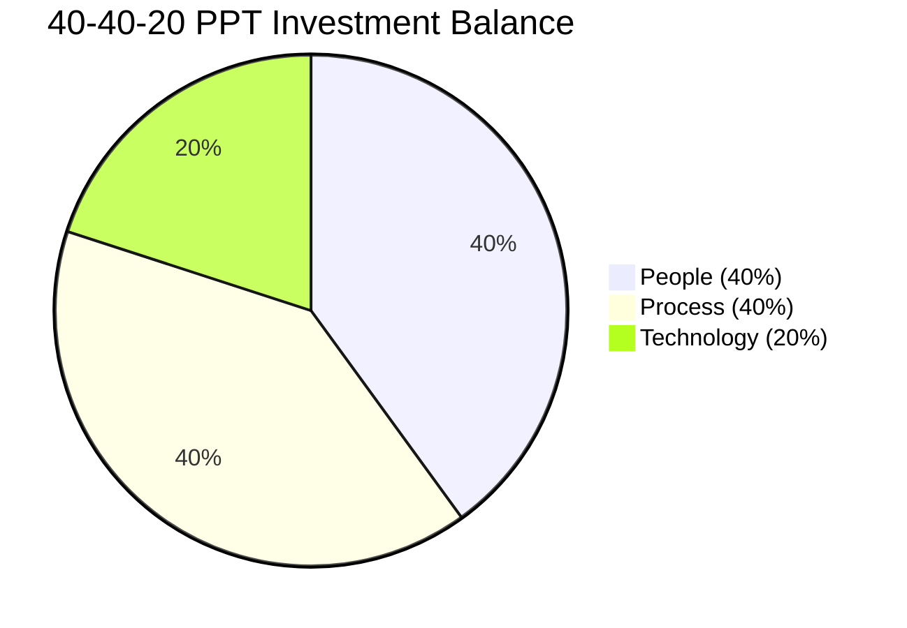
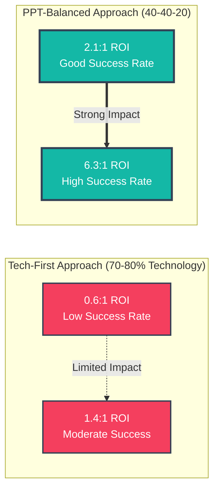

# Layer 2: People & Process Engine

**The Operating Heart of Digital Government**

---

## Executive Summary

Layer 2 is the **People & Process Engine** that transforms policy (Layer 0) and technology (Layer 1) into actual government services (Layer 3). This is where digital government **happens**—where skilled public servants use proven processes to design, build, operate, and improve services for citizens.

**Core Principle: The 40-40-20 PPT Balance**

Unlike traditional IT implementations that over-invest in technology (70-80%), the GaaS framework mandates balanced investment:

- **40% PEOPLE** - Workforce capability, talent, culture, change management
- **40% PROCESS** - Service management, agile delivery, operational procedures
- **20% TECHNOLOGY** - Platforms, tools, infrastructure (enabled by Layer 1)

**Why This Matters:**

70-80% of digital government transformations fail due to insufficient investment in people and process—not technical failures. Organizations investing 37-43% in people and process show ROI ranging from 2.1:1 to 6.3:1, compared to tech-first approaches at 0.6:1 to 1.4:1.

**Evidence:**
- World Bank analysis: 68-74% of failures cite people/organizational factors as primary cause
- Gartner meta-analysis: Organizations investing <20% in people show 2.8-3.4x higher failure rates
- Estonia, Singapore, UAE, Denmark: All successful digital governments maintain 35-40% investment in both people and process dimensions

**Investment Balance Visualization:**



**ROI Comparison:**



---

## Layer 2 Architecture

This layer comprises two integrated dimensions that work as one operating engine:

### **People Dimension (40%)**

The **GaaS Workforce Blueprint** - building and sustaining the human capability required to run a digital government.

**Key Components:**
- Digital government competency framework (10+ role families)
- Talent acquisition and retention strategies
- Career pathways and professional development
- Organizational design and team structures
- Change management and adoption programs
- Leadership capability and executive sponsorship

**Target Outcomes:**
- Attract and retain 200-500+ digitally skilled public servants (depending on government size)
- Reduce vendor dependency from 90% to 40% over 10 years
- Build indigenous capability for 80%+ of digital work by Year 10-15
- Achieve 80%+ digital service adoption through effective change management

**Primary Content:**
- [GaaS Workforce Blueprint](./people/gaas-workforce-blueprint.md)
- [Digital Talent Strategy](./people/digital-talent-strategy.md)

---

### **Process Dimension (40%)**

The **Official Operating Procedures** - the proven, standardized processes for service delivery.

**Key Frameworks:**
- **ITIL v4 (Service Management):** 34 practices adapted for government context
- **Agile/Scrum (Service Delivery):** Iterative, user-centered development
- **Lean Six Sigma (Process Optimization):** Continuous improvement and efficiency
- **COBIT (Governance):** IT governance and risk management
- **DevOps (Technology Operations):** Automated, reliable service operations

**Target Outcomes:**
- 99.0-99.5% service availability by Month 24
- 50-70% reduction in service delivery time by Year 2
- 40-50% reduction in project failure rates through structured governance
- Transparent cost allocation via Technology Business Management (TBM)

**Primary Content - 10 Core Process Playbooks:**

**Strategy & Design:**
1. [Process: Digital Identity Implementation](./processes/process-digital-identity.md)
2. [Process: Co-Design & Citizen Engagement](./processes/process-codesign-engagement.md)
3. [Process: Service Portfolio & Cost Management](./processes/process-service-portfolio-cost.md)

**Build & Deploy:**
4. [Process: API Gateway Deployment](./processes/process-api-gateway.md)
<!-- 5. [Process: Agile Delivery](./processes/process-agile-delivery.md) *(to be created)* -->

**Secure & Govern:**
6. [Process: Zero Trust Migration](./processes/process-zero-trust.md)
7. [Process: Cybersecurity Operations](./processes/process-cybersecurity-operations.md)
8. [Process: Data Governance Framework](./processes/process-data-governance.md)

**Operate & Improve:**
9. [Process: Government Service Management (GSM) Implementation](./processes/process-gsm-implementation.md)
10. [Process: Change Management & Training](./processes/process-change-management.md)

---

## How People & Process Work Together

Layer 2 is not "People OR Process"—it's an integrated engine where both dimensions reinforce each other:

```
EXAMPLE: Launching a New Digital Service

PROCESS provides the METHOD:
├─ Service design playbook defines HOW to design
├─ Agile delivery playbook defines HOW to build
├─ ITIL playbook defines HOW to operate
└─ GSM playbook defines HOW to govern

PEOPLE provide the CAPABILITY:
├─ Service designers PERFORM the design work
├─ Platform engineers BUILD the service
├─ Service managers OPERATE the service
└─ Change champions DRIVE adoption

TOGETHER they deliver VALUE:
└─ A service that works (Process), that citizens use (People)
```

**Real-World Example: Singapore's Singpass**

**People Investment (35%):**
- Recruited 50+ world-class designers and engineers from private sector
- Trained 200+ public servants in service management practices
- Deployed 500+ change champions across agencies
- Executive sponsorship from Prime Minister's Office

**Process Investment (35%):**
- Standardized authentication protocols across all government services
- Implemented ITIL service management for 99.9% uptime
- Agile delivery with 2-week sprints and citizen feedback loops
- TBM cost transparency showing $385M annual value creation

**Technology Investment (30%):**
- Cloud-native architecture (Layer 1 platforms)
- Biometric authentication
- Mobile-first design

**Result:**
- 97% citizen adoption within 3 years
- 99.9% service availability
- $385M annual value from reduced service delivery costs
- Foundation for 1,700+ integrated services

---

## Implementation Approach

### Phase 1: Foundation (Months 1-6)

**People:**
- Establish Digital Transformation Office (DTO) with 30-50 FTEs
- Recruit Chief Digital Officer and key leadership roles
- Skills gap analysis across government workforce
- Design digital career pathways and compensation structures

**Process:**
- Adopt ITIL v4 framework for government service management
- Establish service catalog and service level agreements (SLAs)
- Create agile delivery playbook
- Set up governance councils (PPT Balance Council, Change Advisory Board)

### Phase 2: Capability Building (Months 7-18)

**People:**
- Launch service design bootcamp (40 designers/year)
- Platform engineering academy (30 engineers/year)
- GSM practitioner certification (200+ staff/year)
- Deploy 100+ change champions across agencies

**Process:**
- Pilot ITIL practices on 5-10 priority services
- Implement agile delivery on 3-5 major projects
- Establish incident, problem, and change management processes
- Deploy TBM cost transparency framework

### Phase 3: Operational Maturity (Months 19-36)

**People:**
- Scale training programs to 500+ staff/year
- Build internal capability for 60-80% of digital work
- Establish leadership development program
- Create alumni network for retention

**Process:**
- Achieve 99%+ service availability through mature ITIL practices
- Scale agile delivery to 20-30 concurrent projects
- Implement continual service improvement (CSI)
- Full TBM transparency with cost-per-service reporting

---

## Key Performance Indicators (KPIs)

### People Dimension KPIs

| Metric | Baseline | Year 1 Target | Year 3 Target |
|--------|----------|---------------|---------------|
| Digital workforce headcount | 20-50 | 100-200 | 300-600 |
| Indigenous capability (% of work in-house) | 10% | 30% | 60-80% |
| Staff turnover rate | N/A | <25% | <20% |
| Training completion (staff trained/year) | 0 | 500+ | 1,000+ |
| GSM certifications | 0 | 200+ | 500+ |
| Service design capability (designers) | 0-5 | 30-50 | 80-120 |
| Platform engineering capability | 5-15 | 30-50 | 60-100 |

### Process Dimension KPIs

| Metric | Baseline | Year 1 Target | Year 3 Target |
|--------|----------|---------------|---------------|
| Service availability | 95-97% | 98.5-99.0% | 99.5-99.9% |
| Mean time to resolve (MTTR) incidents | 4-8 hours | 2-4 hours | 1-2 hours |
| Service delivery time reduction | 0% | 30-40% | 50-70% |
| Project failure rate | 40-50% | 25-30% | 10-15% |
| Services with defined SLAs | 10% | 60% | 95%+ |
| Agile delivery maturity | Level 1 | Level 2 | Level 3-4 |
| GSM maturity assessment | Level 1 | Level 2 | Level 3 |
| TBM cost transparency | 0% | 40% | 80%+ |

### Integrated PPT Balance KPI

| Metric | Baseline | Year 1 Target | Year 3 Target |
|--------|----------|---------------|---------------|
| **PPT Investment Ratio** | 70/15/15 | 50/30/20 | **40/40/20** |
| ROI (value created per dollar invested) | 0.6:1 | 1.5:1 | 2.5-3.5:1 |
| Citizen digital service adoption | 15-25% | 50-60% | 75-85% |

---

## Integration with Other Layers

Layer 2 sits at the operational heart of the GaaS framework, connecting all other layers:

**Receives FROM:**
- **Layer 0 (Foundation):** Legal authority, policy mandates, regulatory frameworks
- **Layer 1 (Core):** Shared technology platforms, APIs, infrastructure capabilities

**Delivers TO:**
- **Layer 3 (Portfolio):** Live, operational services with defined costs and SLAs
- **Layer 4 (Experience):** Services ready for citizen consumption via unified channels

**Feedback LOOP:**
- **Layer 4 → Layer 2:** Citizen feedback drives service improvement (continual service improvement)
- **Layer 3 → Layer 2:** Service performance data informs process optimization (TBM metrics)

---

## Reference Implementations

### Estonia (Population: 1.3M)

**People Investment (40%):**
- National digital literacy program (all ages)
- Government workforce reskilling (5,000+ employees over 20 years)
- IT education mandatory from age 7
- E-Governance Academy for international capacity building

**Process Investment (35%):**
- X-Road data exchange governance
- "Once-Only" data sharing protocols
- Transparent decision-making processes
- Agile service delivery model

**Outcome:**
- 99% services online
- 98% government employees digitally capable
- 2% of GDP to run entire government
- €100M+ annual savings

### Singapore (Population: 5.6M)

**People Investment (35%):**
- GovTech: 3,000+ digital professionals
- Competitive compensation (70-85% of private sector)
- World-class talent from Google, Microsoft, Amazon secondments
- 500+ change champions deployed

**Process Investment (35%):**
- ITIL-based service management (99.9% uptime)
- Agile delivery (2-week sprints)
- TBM cost transparency framework
- Continual service improvement culture

**Outcome:**
- $385M annual value from Singpass alone
- 97% digital service adoption
- 1,700+ integrated services
- #1 UN e-Government ranking (multiple years)

### United Arab Emirates (Population: 9.9M)

**People Investment (40%):**
- Federal Digital Government Strategy 2025
- 5,000+ government employees trained in digital skills
- Golden visa program to attract global talent
- Mandatory innovation training for leadership

**Process Investment (30%):**
- UAE Government Service Manual (ITIL-based)
- Smart Dubai Office coordination
- Agile transformation program
- Zero bureaucracy initiative

**Outcome:**
- 90%+ smart services
- $1B+ savings from digital transformation
- Top-10 global e-government ranking
- 95%+ citizen satisfaction with digital services

---

## Common Pitfalls & How to Avoid Them

### Pitfall 1: Technology-First Thinking

**Symptom:** "We'll buy the platform first, then figure out people and process later"

**Consequence:** Platform deployed, no one uses it. 60-70% of investment wasted.

**Solution:** Parallel investment. While procuring Layer 1 platforms, simultaneously:
- Recruit and train Layer 2 workforce
- Design Layer 2 operational processes
- Pilot processes before full platform launch

### Pitfall 2: Underestimating Timeline

**Symptom:** "We can train everyone in 6 months"

**Consequence:** Rushed training produces incompetent practitioners. Service failures erode trust.

**Solution:** Realistic timelines:
- Junior practitioners: 6-9 months training + 12 months to full productivity = 18-24 months
- Senior practitioners: Can't be trained quickly. Must recruit externally (6-12 month hiring cycle)
- Organizational culture change: 24-36 months minimum

### Pitfall 3: Vendor Dependency Trap

**Symptom:** "Consultants will handle implementation, then we'll take over"

**Consequence:** Consultants become permanent. Government never builds internal capability. Costs balloon.

**Solution:** Knowledge transfer mandates:
- Pair programming (1:1 consultant-to-government staff)
- Mandatory documentation and training
- 6-12 month transition period
- Post-exit support limited to 100 hours

### Pitfall 4: Ignoring Civil Service Constraints

**Symptom:** "We'll create special pay scales and flexible hiring like Singapore"

**Consequence:** Blocked by union agreements, procurement rules, facility policies. Strategy fails.

**Solution:** Assess constraints first:
- If reform possible: Pursue "Digital Service Exception" legislation
- If not: Adjust ambitions. Remote work, offshore teams, partner models.

### Pitfall 5: 20% Time That Never Happens

**Symptom:** "Staff can spend 1 day/week on learning"

**Consequence:** Operational demands always take priority. Actual utilization: 5-10%, not 20%.

**Solution:** Be realistic:
- Mandate and track learning time as KPI
- Backfill operational capacity (hire 25% more staff)
- Senior leadership must model behavior
- Or: Budget for 5-7 structured learning days/year + 2 conferences (achievable)

---

## Next Steps

### For Executives

1. Review [GaaS Workforce Blueprint](./people/gaas-workforce-blueprint.md) to understand organizational requirements
2. Study [Process: GSM Implementation](./processes/process-gsm-implementation.md) to establish governance
3. Commit to 40-40-20 PPT investment balance (non-negotiable for success)
4. Secure multi-year funding authorization (3-5 year commitment required)

### For Architects & CTOs

1. Review all 10 Process Playbooks to understand operational dependencies
2. Map Layer 1 (Core) platforms to Layer 2 operational processes
3. Design handoffs between Layer 2 (Engine) and Layer 3 (Portfolio)
4. Plan technology choices that support (not hinder) people and process

### For HR & Change Leaders

1. Conduct skills gap analysis using [Digital Talent Strategy](./people/digital-talent-strategy.md)
2. Design recruitment campaigns targeting digital talent
3. Develop training programs for 500-1,000 staff in Year 1
4. Deploy [Process: Change Management & Training](./processes/process-change-management.md)

### For Service Managers & Operators

1. Study [Process: GSM Implementation](./processes/process-gsm-implementation.md) as foundational playbook
2. Implement ITIL service management practices on pilot services
3. Establish service catalog with SLAs
4. Begin TBM cost transparency tracking

---

## Conclusion: People and Process ARE the Transformation

Technology is easy. Any government can buy a cloud platform, an identity system, or a citizen portal.

**What's hard:**
- Building a workforce capable of designing services citizens love
- Establishing processes that deliver 99.9% uptime and <1 hour service delivery
- Creating a culture of innovation, transparency, and continuous improvement
- Sustaining capability across political cycles and leadership changes

**Layer 2 is where transformation happens—or fails.**

The governments that succeed (Estonia, Singapore, UAE, Denmark) invest 35-40% in people, 35-40% in process, and 20-30% in technology. The governments that fail invert this ratio and wonder why expensive platforms sit unused.

**The choice is yours.**

---

**Next:** Explore the **People Dimension** ([Workforce Blueprint](./people/gaas-workforce-blueprint.md), [Talent Strategy](./people/digital-talent-strategy.md)) or the **Process Dimension** ([GSM Implementation](./processes/process-gsm-implementation.md), [All Playbooks](./processes/process-digital-identity.md)) to begin your Layer 2 implementation.
